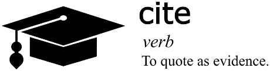

# [atet](https://github.com/atet) / [**_cite_**](https://github.com/atet/cite/blob/main/README.md#atet--cite)

# Collected Citations and References

This is my personal repository of useful information from around the world.

----------------------------------------------------------------------------

## Table of Contents

* [0. Introduction](#0-introduction)
* [1. Science](#1-science)
* [2. Technology](#2-technology)
* [3. Engineering](#3-engineering)
* [4. Arts](#4-arts)
* [5. Mathematics](#5-mathematics)
* [6. Business](#6-business)
* [7. Quotes](#7-quotes)

### Supplemental

* [Other Resources](#other-resources)
* [Troubleshooting](#troubleshooting)

----------------------------------------------------------------------------

## 0. Introduction

### References and Citations

This repository will use the Chicago Manual of Style's Author-Date System[1](#other-resources):

* **Journal Article**
    * **Reference Format**:
        * Keng, Shao-Hsun, Chun-Hung Lin, and Peter F. Orazem. 2017. “Expanding College Access in Taiwan, 1978–2014: Effects on Graduate Quality and Income Inequality.” *Journal of Human Capital* 11, no. 1 (Spring): 1–34. https://doi.org/10.1086/690235.
    * **Citation Format**:
        * (Keng, Lin, and Orazem 2017, 9–10)
    * **Caveat**: If there are more than four authors (typical of academic journals), use *et al.*
        * (Bay et al. 2017, 465)
* **Newspapers and Magazines**
    * **Reference Format**:
        * Manjoo, Farhad. 2017. “Snap Makes a Bet on the Cultural Supremacy of the Camera.” *New York Times*, March 8, 2017. https://www.nytimes.com/2017/03/08/technology/snap-makes-a-bet-on-the-cultural-supremacy-of-the-camera.html.
    * **Citation Format**:
        * (Manjoo 2017)
    * **Caveat**: Page numbers are omitted in the reference but can be in the citation
* **Website Content**
    * **Reference Format**:
        * Bouman, Katie. 2016. “How to Take a Picture of a Black Hole.” Filmed November 2016 at TEDxBeaconStreet, Brookline, MA. Video, 12:51. https://www.ted.com/talks/katie_bouman_what_does_a_black_hole_look_like.
    * **Citation Format**:
        * (Bouman 2016)

### Artificial Intelligence Content

Recent guidance by the Chicago Manual of Style regarding content from large language models (LLMs) like ChatGPT are that these LLM technologies, colloquially known as "artificial intelligence" (AI), must be acknowledged if used as a source of information[2](#other-resources).

There are multiple scenarios with differing guidance for reference and citation format. Since this repository will display all AI-generated content for public reference, the following format will be used:

* **Publicly Available Artificial Intelligence Content**
    * **Reference Format**:
        * Claude, Anthropic, January 23, 2024, https://github.com/atet/cite.
    * **Citation Format**:
        * (Claude, January 23, 2024)

### Boston University Academic Conduct Code

Boston University's Questrom School of Business permits AI-generated content to be used as a source of information with proper acknowledgement. Sufficient due diligence will be performed to ensure that the content in this repository is logical and factually correct. 

> **Academic Conduct Code**
> 
> . . .
> 
> Boston University’s Academic Conduct Code is designed to assist in the development of a supportive and productive learning environment. It is both a description of the University’s ethical expectations of students as well as a guarantee of students’ rights and responsibilities as members of a learning community. The Code provides clarity related to policy and procedure regarding academic conduct.
>
> Effective January 1, 2024. This policy applies to all students except the following, who should refer to their academic conduct codes: School of Law students and MD students in the Chobanian & Avedisian School of Medicine.
>
> . . .
>
> III. Violations of this Code
>
> . . .
>
> B. Plagiarism. Representing the work or ideas of another* as one’s own and/or using another’s work or ideas without appropriately crediting the source. Plagiarism includes, but is not limited to, the following: copying the answers of another student on an examination; copying or **restating the work or ideas of another person/persons or artificial intelligence software** in any oral or written work (printed or electronic) **without appropriately citing the source**; using visuals, audio, or video footage that comes from another source (including work done by another student) without permission and/or acknowledgement of that source; and collaborating with someone else in an academic endeavor without acknowledging their contribution. Plagiarism can consist of acts of commission (appropriating the words or ideas of another as one’s own), or omission (failing to acknowledge/document/credit the source or creator of words or ideas).
>
> *“Another” may refer to **anything that can be a source of information** or work product, including (but not limited to) individuals, books, online sources, academic journals, and **software/programs (e.g., artificial intelligence software/programs)**.
>
> . . .
* Excerpts from Boston University's Academic Conduct Code specifically referencing the use of AI-generated information[3](#other-resources).

[Back to Top](#table-of-contents)

----------------------------------------------------------------------------

## 1. Science

[Back to Top](#table-of-contents)

----------------------------------------------------------------------------

## 2. Technology

[Back to Top](#table-of-contents)

----------------------------------------------------------------------------

## 3. Engineering

[Back to Top](#table-of-contents)

----------------------------------------------------------------------------

## 4. Arts

[Back to Top](#table-of-contents)

----------------------------------------------------------------------------

## 5. Mathematics

[Back to Top](#table-of-contents)

----------------------------------------------------------------------------

## 6. Business

* [20240123 - Identifying Additional Business Stakeholders Beyond the Typical Five](./.dat/business/20240123_Identifying_Additional_Business_Stakeholders_Beyond_the_Typical_Five.md)

[Back to Top](#table-of-contents)

----------------------------------------------------------------------------

## 7. Quotes

>  When you are deciding on next steps, next jobs, next careers, further education, you should find purpose rather than a job or a career. **Purpose crosses disciplines**. Purpose is an essential element of you. It is the reason you are on the planet at this particular time in history. Your very existence is wrapped up in the things you need to fulfill.
>
> — Chadwick Boseman —

[Back to Top](#table-of-contents)

----------------------------------------------------------------------------

## Other Resources

**Description** | **URL Link**
--- | ---
**Chicago Manual of Style** | https://www.chicagomanualofstyle.org/home.html
1**Chicago Manual of Style**: Author-Date System | https://www.chicagomanualofstyle.org/tools_citationguide/citation-guide-2.html
2**Chicago Manual of Style**: Artificial Intelligence Content | https://www.chicagomanualofstyle.org/qanda/data/faq/topics/Documentation/faq0422.html
3**Boston University**: Academic Conduct Code | https://www.bu.edu/academics/policies/academic-conduct-code/

[Back to Top](#table-of-contents)

----------------------------------------------------------------------------

## Troubleshooting

Issue | Solution
--- | ---
***How can I replicate the AI-generated responses seen here?*** | Commercial LLMs are stochastic, meaning they will produce inconsistent and seemingly random results every time they are used.

[Back to Top](#table-of-contents)

----------------------------------------------------------------------------

Copyright © 2024-∞ Athit Kao, <a href="http://www.athitkao.com/tos.html" target="_blank">Terms and Conditions</a>
